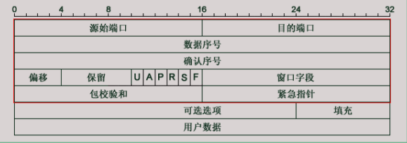
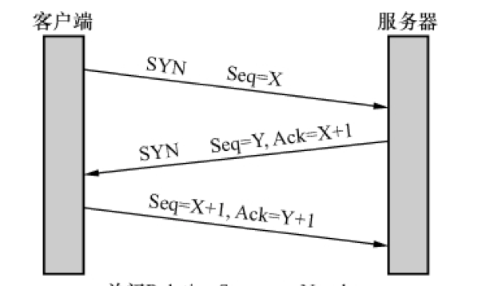
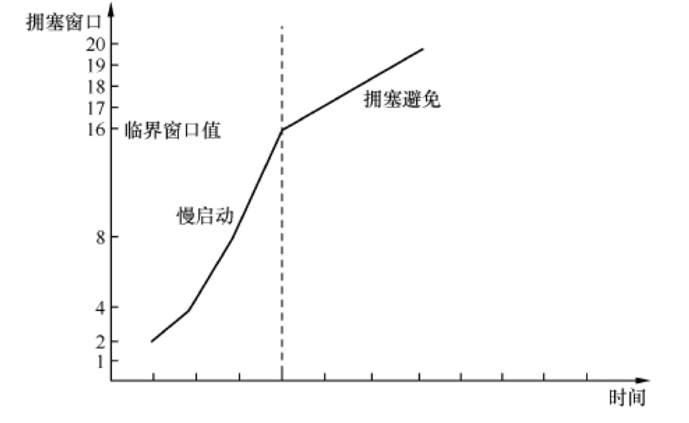
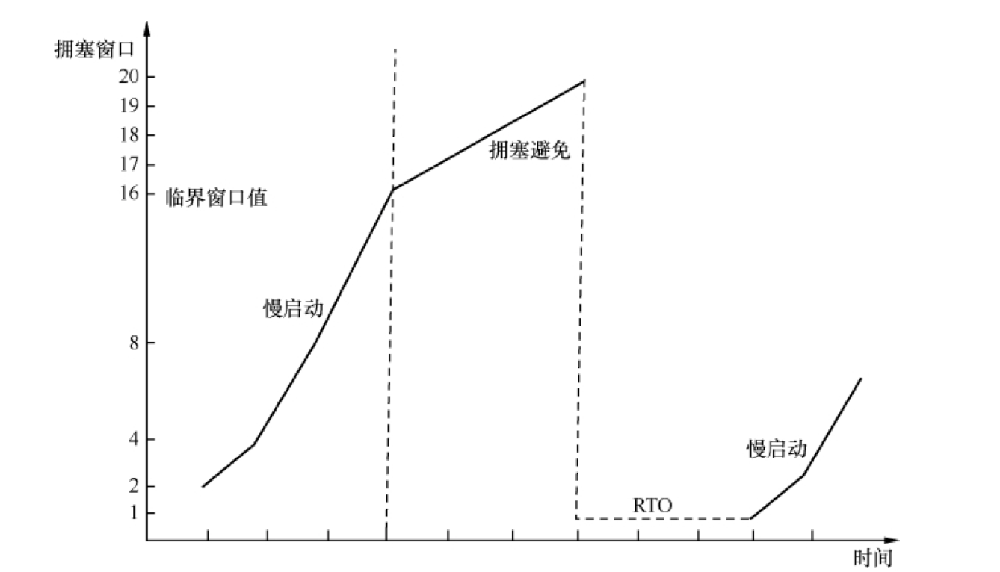

## 说明
因为不可描述的原因，看了一下tcp的具体细节

## 基础细节tcp报文头部

1. src port 
	* 源端口
	* 2byte，诞生了著名的问题为什么端口号长度最大 1<<16-1
2. dest port 
	* 目标端口
	* 2byte
3. seq
	* 序列号，标示包的顺序
	* 4byte
4. ack
	* 确认号，标识对方tcp报文seq+有效数据len
	* 4byte
5. header len
	* 头部长度，表示tcp头部有多少个32bit
	* 4bit
6. reserved
	* 保留位
	* 6bit
7. flag
	* URG ACK PSH RST SYN FIN
	* 6bit
8. win
	* 接收窗口大小 (还可以通过option win scale来扩大窗口大小)
	* 2byte
9. checksum
	* 校验和
	* 2byte
10. urgent pointer
	* 紧急指针
	* 2byte
11. option
	* 选项
	* max 40byte
	* 三次握手时会有MSS（Maxitum Segment Size）大小，最终mss取决于较小mss
12. data
	* body 承载应用层协议的内容

## 三次握手

1. 标识位SYN置1，seq=X (X 是初始化值 不是必须为0) ACK=0
2. 标识位SYN ACK置1，seq=Y (同理) ack=X+1
3. 标识位ACK置1，seq=X+1 ack=Y+1

需要注意的是，尽管客户端没有发送任何有效数据，确认号还是被加1，这是因为接收的包中包含SYN或FIN标志位（并不会对有效数据的计数产生影响，因为含有SYN或FIN标志位的包并不携带有效数据）
> seq用于表示包的顺序，因为网络传输过程中，接收方的包可能是乱序的，这时候由seq来决定位置
> 
> seq值第一次取决于初始化，之后都是上一次的seq加上数据len
> 
> ack=seq+len 即发送包的seq加有效数据长度

### 为什么要3次挥手2次不行么？
为了防止已失效的连接请求报文段突然又传送到了服务端，因而产生错误。

本来这是一个早已失效的报文段。但server收到此失效的连接请求报文段后，就误认为是client再次发出的一个新的连接请求。于是就向client发出确认报文段，同意建立连接。假设不采用“三次握手”，那么只要server发出确认，新的连接就建立了。由于现在client并没有发出建立连接的请求，因此不会理睬server的确认，也不会向server发送数据。但server却以为新的运输连接已经建立，并一直等待client发来数据。这样，server的很多资源就白白浪费掉了。

## 4次挥手

挥手和握手不同之处在于

1. SYN 置0 FIN 置1
2. 多一次挥手原因，tcp是全双工数据流传输协议，当客户端告知要结束本次连接时，数据传输可能并没有结束。

其实用四次挥手来断开连接也不完全可靠，但世界上不存在 100%可靠的通信机制。假如对这个话题感兴趣，可以研究一下著名的“两军问题”，

## TCP窗口

TCP传输有“往返”的需要。因为发包之后并不知道对方能否收到，要一直等到确认包到达，这样就花费了一个往返时间。假如每发一个包就停下来等确认，一个往返时间里就只能传一个包，这样的传输效率太低了。最快的方式应该是一口气把所有包发出去，然后一起确认。但现实中也存在一些限制：接收方的缓存（接收窗口）可能一下子接受不了这么多数据；网络的带宽也不一定足够大，一口气发太多会导致丢包事故。所以，发送方要知道接收方的接收窗口和网络这两个限制因素中哪一个更严格，然后在其限制范围内尽可能多发包。这个一口气能发送的数据量就是TCP发送窗口。

### 接收窗口和MSS的关系

对方的窗口大小决定了一口气能发多少字节，而MSS决定了这些字节要分多少个包发完。举个例子，在发送窗口为16000字节的情况下，如果MSS是1000字节，那就需要发送16000/1000=16个包；而如果MSS等于8000，那要发送的包数就是16000/8000=2了。

### 前文提到的option中win scale的作用

在TCP刚被发明的时候，全世界的网络带宽都很小，所以最大接收窗口被定义成65535字节。随着硬件的革命性进步，65535字节已经成为性能瓶颈了，怎么样才能扩展呢？TCP头中只给接收窗口值留了16bit，肯定是无法突破65535（216−1）的。1992年的RFC1323中提出了一个解决方案，就是在三次握手时，把自己的WindowScale信息告知对方。由于WindowScale放在TCP头之外的Options中，所以不需要修改TCP头的设计。WindowScale的作用是向对方声明一个Shiftcount，我们把它作为2的指数，再乘以TCP头中定义的接收窗口，就得到真正的TCP接收窗口了。

## 重传
网络之所以能限制发送窗口，是因为它一口气收到太多数据时就会拥塞。拥塞的结果是丢包，这是发送方最忌惮的。能导致网络拥塞的数据量称为拥塞点，发送方当然希望把发送窗口控制在拥塞点以下，这样就能避免拥塞了。但问题是连网络设备都不知道自己的拥塞点，即便知道了也无法通知发送方。这种情况下发送方如何避免触碰拥塞点呢？就是在发送方维护一个虚拟的**拥塞窗口**，并利用各种算法使它尽可能接近真实的拥塞点。

### 慢启动

1. 连接刚刚建立的时候，发送方对网络状况一无所知。如果一口气发太多数据就可能遭遇拥塞，所以发送方把拥塞窗口的初始值定得很小。RFC的建议是2个、3个或者4个MSS，具体视MSS的大小而定。
2. 如果发出去的包都得到确认，表明还没有达到拥塞点，可以增大拥塞窗口。由于这个阶段发生拥塞的概率很低，所以增速应该快一些。RFC建议的算法是每收到n个确认，可以把**拥塞窗口**增加n个MSS。比如发了2个包之后收到2个确认，拥塞窗口就增大到2+2=4，接下来是4+4=8,8+8=16……这个过程的增速很快，但是由于基数低，传输速度还是比较慢的，所以被称为慢启动过程。

### 拥塞避免

1. 慢启动过程持续一段时间后，**拥塞窗口**达到一个较大的值。这时候传输速度比较快，触碰拥塞点的概率也大了，所以不能继续采用翻倍的慢启动算法，而是要缓慢一点。RFC建议的算法是在每个往返时间增加1个MSS。比如发了16个MSS之后全部被确认了，拥塞窗口就增加到16+1=17个MSS，再接下去是17+1=18,18+1=19……这个过程称为**拥塞避免**。从慢启动过渡到拥塞避免的临界窗口值很有讲究。如果之前发生过拥塞，就把该拥塞点作为参考依据。如果从来没有拥塞过就可以取相对较大的值，比如和最大接收窗口相等。

### 超时重传（RTO）

1. 拥塞之后会发生什么情况呢？对发送方来说，就是发出去的包不像往常一样得到确认了。不过收不到确认也可能是网络延迟所致，所以发送方决定等待一小段时间后再判断。假如迟迟收不到，就认定包已经丢失，只能重传了。这个过程称为超时重传。
2. 重传之后的**拥塞窗口**是否需要调整呢？非常有必要，为了不给刚发生拥塞的网络雪上加霜，RFC建议把拥塞窗口降到1个MSS，然后再次进入慢启动过程。
3. 这一次从慢启动过渡到拥塞避免的临界窗口值就有参考依据了。RFC5681建议**临界窗口**更改为发生拥塞时没被确认的数据量的1/2，但不能小于2个MSS。

### 快速重传

1. 有时候拥塞很轻微，只有少量的包丢失。还有些偶然因素，比如校验码不对的时候，会导致单个丢包。这两种丢包症状和严重拥塞时不一样，因为后续有包能正常到达。当后续的包到达接收方时，接收方会发现其Seq号比期望的大，所以它每收到一个包就Ack一次期望的Seq号，以此提醒发送方重传。当发送方收到3个或以上重复确认（DupAck）时，就意识到相应的包已经丢了，从而立即重传它。这个过程称为快速重传。之所以称为快速，是因为它不像超时重传一样需要等待一段时间。
2. 如果在拥塞避免阶段发生了快速重传，是否需要像发生超时重传一样处理拥塞窗口呢？完全没有必要—既然后续的包都到达了，说明网络并没有严重拥塞，接下来传慢点就可以了。RFC5681建议**临界窗口**值应该设为发生拥塞时还没被确认的数据量的1/2（但不能小于2个MSS）。然后将**拥塞窗口**设置为临界窗口值加3个MSS，继续保留在拥塞避免阶段。

> 快速重传还涉及到多种案例，可以了解SACK、NewReno

### 其他

1. tcp缓冲机制还涉及到延时确认和Nagle算法个有利弊。可以选择开启关闭。
2. 实际上tcp算法有很多种实现，每种实现都有自己的独到之处，比如Westwood和Vegas等。

